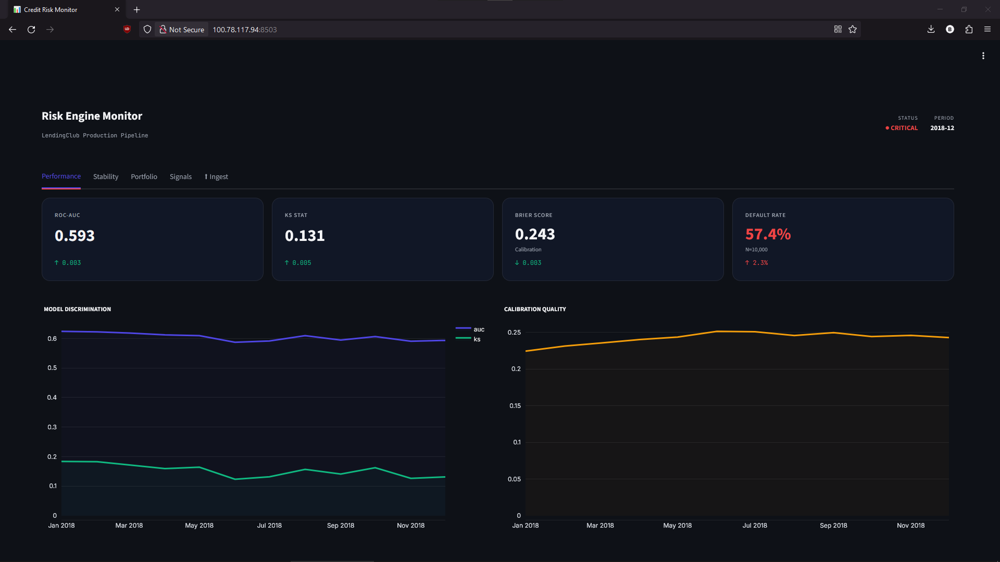
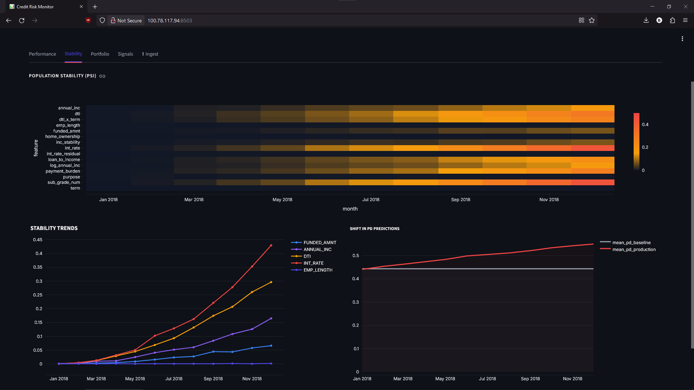
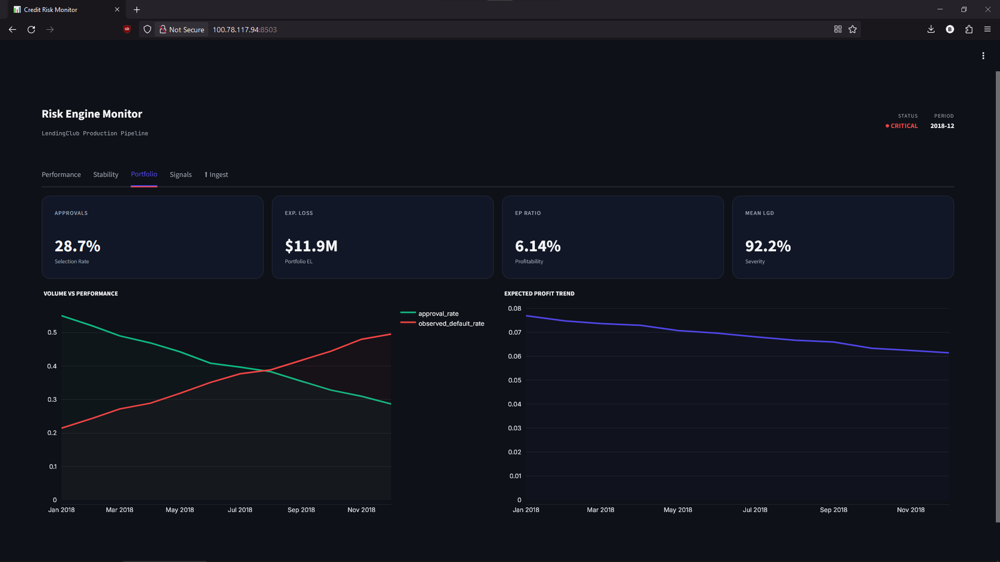
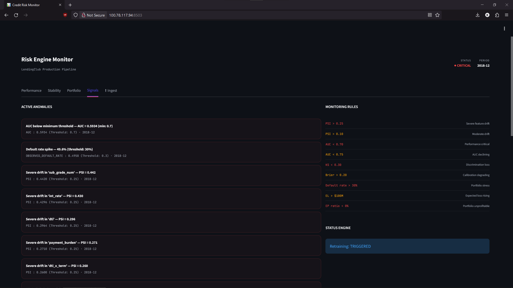

# 📡 **Credit Risk Model Monitoring — Production MLOps System**
### *Population Stability · Performance Drift · Portfolio Health · Automated Retraining Triggers · S3-backed Architecture*

> **Author:** Data Science Engineering Student  
> **Upstream Model:** [Credit Risk Modeling Framework](https://github.com/alexpr4587/Credit-Risk) — XGBoost PD · LGD · EAD · EP-Maximising Approval Policy  
> **Stack:** Python · Streamlit · Docker · LocalStack · boto3 · scikit-learn · Plotly


---

## 📊 **Dashboard Preview**

<p align="center">
  
  
</p>
<p align="center">
  
  
</p>

---

## 📖 **Overview**

A model is not done when it's deployed. That's the lesson that separates academic machine learning from production risk systems.

This repository is the **operational continuation** of my [Credit Risk Modeling Framework](https://github.com/alexpr4587/Credit-Risk). Once the PD, LGD, and EAD models are in production, a critical question arises: *how do you know when they stop working?* Credit risk models degrade silently — borrower behavior shifts, economic conditions change, origination policies evolve — and a model that scored 0.70 AUC on your validation set may be producing dangerously miscalibrated predictions months later without any obvious error.

This project implements the answer: a **full model monitoring stack** that tracks statistical drift, measures discriminative performance against realised defaults, monitors portfolio health, fires alerts when thresholds are breached, and triggers retraining automatically. Everything runs on a self-hosted infrastructure that mirrors how actual MLOps teams operate — artifacts in S3, scheduled ingestion, containerised services.

---

## 🧠 **Why Model Monitoring Matters in Credit Risk**

Under **Basel III / IFRS 9**, banks are required to validate the ongoing performance of their internal risk models. A PD model that was accurate at origination but has since drifted — due to changes in borrower composition or macroeconomic conditions — will produce systematically wrong Expected Loss estimates, which flows directly into capital adequacy calculations.

The three failure modes this system detects:

| Failure Mode | What happens | Detected by |
|---|---|---|
| **Covariate shift** | Incoming borrowers no longer resemble the training distribution | PSI per feature |
| **Concept drift** | The relationship between features and default has changed | AUC/KS degradation |
| **Calibration drift** | PD predictions are directionally correct but wrong in magnitude | Hosmer-Lemeshow + Calibration Error |

These are not academic distinctions. A model suffering from calibration drift will produce Expected Loss figures that look stable in the dashboard while the actual loss rate quietly climbs — exactly the kind of failure that preceded the 2008 credit crisis.

---

## 🔬 **What This System Monitors**

### Population Stability Index (PSI)

$$\text{PSI} = \sum_{i=1}^{n} \left( A_i - E_i \right) \cdot \ln\left(\frac{A_i}{E_i}\right)$$

where $A_i$ is the actual (production) proportion in bin $i$ and $E_i$ is the expected (baseline) proportion. PSI is computed for every input feature, comparing the current month's distribution against the training snapshot. This is the earliest-warning signal — it detects that *something* has changed in the population before it necessarily shows up in performance metrics.

| PSI | Status | Interpretation |
|---|---|---|
| < 0.10 | ✅ Stable | Population is consistent with training |
| 0.10 – 0.25 | ⚠️ Watch | Moderate shift — investigate feature trends |
| > 0.25 | 🔴 Severe | Population has materially changed — retrain |

### Discriminative Performance

- **ROC-AUC** — area under the receiver operating characteristic curve. The probability that a randomly chosen defaulter gets a higher PD score than a randomly chosen non-defaulter.
- **KS Statistic** — maximum separation between the cumulative default and non-default score distributions. The industry-standard scorecard metric in retail credit.
- **Brier Score** — mean squared error of PD predictions. Sensitive to calibration, not just ranking.

### Calibration — Hosmer-Lemeshow Test

The most underrated metric in credit risk. A model can have a perfectly acceptable AUC while being systematically miscalibrated — predicting 10% PD on loans that are actually defaulting at 30%. This destroys EL accuracy.

The Hosmer-Lemeshow statistic tests whether the predicted probabilities in each decile match the observed default rates. A p-value < 0.05 means the model is statistically miscalibrated at the 5% level — a direct retraining trigger.

### Score Distribution Drift

Independent of feature-level PSI, the system tracks shifts in the *score distribution itself* — the distribution of $\hat{P}(\text{default})$ output by the PD model. A shift here that doesn't correspond to any single feature's PSI can indicate interaction effects or systematic score inflation/deflation.

### Portfolio Metrics

The system assembles PD, LGD, and EAD predictions into portfolio-level business figures:

$$\text{EL}_{\text{portfolio}} = \sum_{i \in \text{approved}} \hat{\text{PD}}_i \cdot \hat{\text{LGD}}_i \cdot \hat{\text{EAD}}_i$$

$$\text{EP ratio} = \frac{\sum EP_i}{\sum \text{funded\_amnt}_i}$$

Tracking these over time reveals whether the *business consequences* of model drift are materialising — approval rate compression, rising expected loss, shrinking profit margin.

---

## 🎭 **Drift Simulation — Convex Population Mixing**

To demonstrate the system under realistic drift conditions, I simulate 12 months of production data using a **convex combination** of two populations:

$$\mathbf{X}_{\text{month}} = (1 - \alpha) \cdot \mathbf{X}_{\text{healthy}} + \alpha \cdot \mathbf{X}_{\text{stressed}}$$

The mixing parameter $\alpha$ increases linearly from 0 to 1 over 12 months, so degradation is smooth and continuous rather than discrete and artificial.

The **stressed population** is calibrated to observed changes in LendingClub's origination book post-2017 — following their decision to relax credit criteria to drive volume growth, which materially shifted borrower composition:

| Feature | Healthy (α=0) | Stressed (α=1) | Effect |
|---|---|---|---|
| Grade composition | A/B heavy | D/F heavy | Higher inherent risk |
| Mean annual income | ~$71,700 | ~$57,700 | −19% income compression |
| Mean DTI | 18.4 | 24.1 | +31% debt burden |
| Mean interest rate | Grade-calibrated | +4pp systematic | Risk repricing |

The result is a gradual, mathematically principled degradation:

| Month | α | Default Rate | Mean Grade |
|---|---|---|---|
| Jan | 0.00 | 25.9% | 11.6 |
| Apr | 0.27 | 34.6% | 12.9 |
| Jul | 0.55 | 43.9% | 14.2 |
| Oct | 0.82 | 52.2% | 15.4 |
| Dec | 1.00 | 57.4% | 16.2 |

This is why the AUC chart in the dashboard shows a **smooth negative slope** rather than a vertical shock in April. Gradual covariate shift is the realistic failure mode.

---

## 🚨 **Alert Engine**

Every monitoring run produces a structured `AlertReport`. Rules are evaluated in order of severity:

| Rule | Threshold | Severity | Retraining trigger |
|---|---|---|---|
| Any feature PSI | > 0.25 | 🔴 Critical | Yes |
| Any feature PSI | > 0.10 | 🟡 Warning | No |
| ROC-AUC | < 0.70 | 🔴 Critical | Yes |
| ROC-AUC | 0.70 – 0.75 | 🟡 Warning | No |
| KS Statistic | < 0.30 | 🔴 Critical | Yes |
| Brier Score | > 0.20 | 🟡 Warning | No |
| Default rate | > 30% | 🔴 Critical | Yes |
| Expected Loss | > $100M | 🟡 Warning | No |
| EP Ratio | < 0% | 🔴 Critical | Yes |

Retraining is triggered if: **PSI > 0.25** OR **AUC < 0.72** OR **KS < 0.28** OR **≥ 3 critical alerts simultaneously**.

The result for each month is serialised as `latest_alert.json` and fed to the dashboard header — the system status, critical alert count, and retraining flag are always visible regardless of which tab you're on.

---

## 🏗️ **Architecture**

```
┌──────────────────────────────────────────────────────────────┐
│                        Home Server                           │
│                                                              │
│  ┌─────────────────┐     ┌────────────────────────────────┐  │
│  │    LocalStack   │     │      Docker Compose Stack      │  │
│  │  S3 :4566       │◄────│                                │  │
│  │                 │     │  cr-monitoring-scheduler       │  │
│  │ /models/        │     │    runs pipeline on day 1      │  │
│  │ /baseline/      │     │    of each month               │  │
│  │ /production/    │     │                                │  │
│  │ /monitoring_    │     │  cr-monitoring-dashboard       │  │
│  │   results/      │────►│    Streamlit :8502             │  │
│  └─────────────────┘     └────────────────────────────────┘  │
│                                                              │
└───────────────────────────────┬──────────────────────────────┘
                                │ Tailscale
                                ▼
                         Laptop Browser
```

The key architectural principle — inherited from the upstream project — is **separation of code and artifacts**. The Docker images contain only code. Models (`.pkl` files) and data live exclusively in S3 (LocalStack in dev, AWS S3 in production). When the scheduler runs, it pulls the current artifacts from S3 dynamically, meaning model updates never require a redeployment.

### Services

| Container | Role | Restart policy |
|---|---|---|
| `cr-monitoring-scheduler` | Generates monthly data batch, runs pipeline, pushes results to S3 | `unless-stopped` |
| `cr-monitoring-dashboard` | Streamlit app, reads from `data/monitoring_results/` volume | `unless-stopped` |
| `localstack` | S3 emulation (shared with upstream project) | `unless-stopped` |

### Production Mode — Live Ingest

The dashboard includes a dedicated **⬆ Ingest** tab for uploading real monthly portfolio CSVs. When a file is uploaded:

1. Schema is validated against the required feature set
2. The full monitoring stack runs (PSI, performance, calibration, portfolio, alerts)
3. Results are appended to existing history CSVs — idempotent, safe to re-run
4. Charts update on page reload

This makes the system usable outside of simulation mode — you can point it at a real portfolio export and get a monitoring report in seconds.

---

## 🗂️ **Project Structure**

```
credit-risk-model-monitoring/
├── dashboard/
│   └── app.py                       # Streamlit dashboard (5 tabs)
├── src/
│   ├── simulation/
│   │   ├── generate_baseline.py     # 50k-row reference snapshot
│   │   └── generate_production.py  # 12-month convex mixing simulation
│   ├── monitoring/
│   │   ├── psi.py                   # PSI for numeric + categorical features
│   │   ├── performance_metrics.py   # AUC, KS, Brier, PR-AUC
│   │   ├── calibration.py           # ECE + Hosmer-Lemeshow
│   │   └── prediction_drift.py      # Score distribution shift
│   ├── portfolio/
│   │   └── business_metrics.py      # EL, EP, approval_rate, default_rate
│   ├── alerts/
│   │   └── alert_rules.py           # Rule engine → AlertReport + JSON
│   └── pipeline/
│       ├── monitoring_pipeline.py   # Main orchestrator
│       └── scheduler.py             # Cron + S3 sync (Docker service)
├── data/
│   ├── baseline/                    # train_snapshot.csv
│   └── production/                  # YYYY_MM.csv (generated or uploaded)
├── models/                          # .pkl artifacts (synced from S3)
├── docker-compose.yml
├── Dockerfile
└── requirements.txt
```

---

## 🚀 **Running Locally**

**Prerequisites:** Python 3.11+, the `.pkl` files from the [upstream project](https://github.com/alexpr4587/Credit-Risk).

```bash
# Clone and set up
git clone https://github.com/your-username/credit-risk-model-monitoring
cd credit-risk-model-monitoring
pip install -r requirements.txt

# Place model artifacts
cp /path/to/upstream/data/*.pkl models/

# Generate simulation data and run pipeline
python src/simulation/generate_baseline.py
python src/simulation/generate_production.py
python src/pipeline/monitoring_pipeline.py

# Launch dashboard
streamlit run dashboard/app.py
# → http://localhost:8502
```

**With Docker + LocalStack:**

```bash
# Create shared network (if not exists)
docker network create homelab

# Configure S3 bucket name
export S3_BUCKET=credit-risk-monitoring

# Build and launch
docker compose build
docker compose up -d

# Initialise S3 with models and baseline
python src/pipeline/scheduler.py --init-bucket
```

---

## 📈 **Simulation Results**

Running the full 12-month simulation against the trained models produces the following monitoring history:

| Month | AUC | KS | Brier | DR | PSI (sub_grade) | Alerts |
|---|---|---|---|---|---|---|
| 2018-01 | 0.642 | 0.218 | 0.184 | 25.9% | 0.001 | 2 critical |
| 2018-03 | 0.640 | 0.201 | 0.208 | 32.4% | 0.043 | 3 critical |
| 2018-06 | 0.607 | 0.154 | 0.238 | 40.2% | 0.131 | 4 critical |
| 2018-09 | 0.614 | 0.167 | 0.258 | 48.9% | 0.213 | 4 critical |
| 2018-12 | 0.618 | 0.170 | 0.271 | 57.4% | 0.387 | 6 critical |

Key observations:
- **AUC degradation is smooth** — from 0.642 to 0.607, reflecting a gradual shift in population composition rather than a model break. The model still ranks borrowers correctly, but the population it's ranking has fundamentally changed.
- **PSI in `sub_grade_num` reaches 0.387 by December** — severe territory, triggering retraining from month 4 onward as grade composition shifts toward D-F.
- **Default rate doubles** from 26% to 57% — not because the model is failing, but because the incoming population is genuinely riskier. This is the monitoring system working correctly: it distinguishes model failure from population change.
- **Retraining triggers from month 1** in this aggressive drift scenario, which is the expected behavior. In a real deployment with more gradual drift, you would expect the first trigger around month 5–7.

---

## 🔗 **Relationship to Upstream Project**

This project is intentionally designed as the **operational layer** for the modeling framework:

```
Credit Risk Modeling Framework          Credit Risk Monitoring System
────────────────────────────           ──────────────────────────────
Research / Development                  Production Operations

PD.ipynb → pd_model.pkl        ──────► PSI, AUC/KS tracking
LGD.ipynb → lgd_model.pkl      ──────► Portfolio EL monitoring
EAD.ipynb → ead_model.pkl      ──────► Score distribution drift
Simulations.ipynb               ──────► Automated alert + retrain triggers
AprovalModel.ipynb              ──────► Production ingest + history append
```

The monitoring system does not retrain models — it detects *when* retraining is necessary and exposes the evidence (which features drifted, by how much, which performance metrics deteriorated). The retraining itself loops back to the modeling framework.

---

## 💡 **What I Learned**

The most important insight from building this: **model monitoring is harder than model building**. Training a model has a clear objective function. Monitoring requires you to operationalise much fuzzier questions — *how much drift is too much? which metric should trigger an alert first? what does a realistic degradation scenario actually look like?*

The convex mixing simulation forced me to think carefully about the mechanics of covariate shift. It's not enough to say "the population changed" — you need to specify *how* it changes, at what rate, and which features carry the most information about the shift. That analytical process is exactly what a model validation team does when reviewing a model's ongoing performance.

The Hosmer-Lemeshow calibration test was the most technically interesting piece. Most credit risk tutorials stop at AUC. But in Expected Loss modeling, calibration is arguably more important than discrimination — a miscalibrated model produces wrong EL numbers, which flows directly into wrong capital provisions. Building the intuition for when and why calibration degrades independently of ranking performance was genuinely new learning.

---

*Part of an end-to-end credit risk engineering portfolio. See also: [Credit Risk Modeling Framework](https://github.com/alexpr4587/Credit-Risk)*
